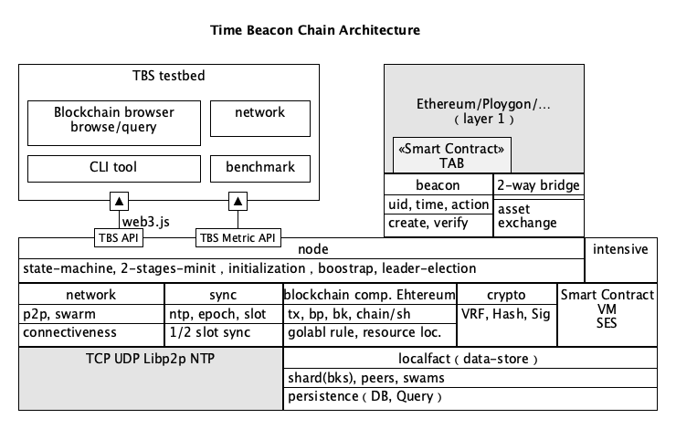

# TDS
TBS is a high-performance blockchain scaling platform that achieves impressive scalability without compromising on security or decentralization. 

## How does it work?

TBS utilizes sharding technology, and maintains security through frequent reconfiguration of its stateless committees. The platform introduces a time beacon chain to assist these committees in verifying intra-shard and cross-shard transactions. The time beacon chain runs parallel to the sharding chains and is utilized by sharding chains to store and request its state root. Any secure blockchain that supports smart contracts can be used as TBS's time beacon chain, with Ethereum, Gnosis Chain, and Polygon currently supported. TBS boasts impressive performance, capable of achieving over 100,000 TPS with thousands of nodes.





Vue and ECharts and Threejs are used for visualization. Meanwhile, a Github CI/CD action is setup for automatically distribute the whole DApp via IPFS, 
and the web3.storage will be used soon to record/publish the testing results.

## Features
* [x] theoretical verification and prototype design
* [x] benchmark of performance & resource consumption
* [x] beacon chain contracts
* [x] testnet Dapp develop tool
* [ ] real testnet data driven frontend

## Access now

### GA

* Project Gateway 
* IPFS Gateway 

### Snapshot

* Project Gateway 
* IPFS Gateway 

## Getting started
### development
```
npm install
npm run dev
```
Then visit http://localhost:3000 (default)
### build and preview
```
npm run build
npm run serve
```
Then visit http://localhost:4173 (default)

## References
1. [W3Chain: A Layer2 Blockchain Defeating the Scalability Trilemma]()(Acceped by ICBC 2023 and will be released soon)
2. [W3 Whitepaper](https://wiki.mq-ai.cn/display/WEB3/W3+Whitepaper) (beta release soon)
3. [Consensusless Blockchain: A Promising High-Performance Blockchain without Consensus](https://arxiv.org/abs/2208.12381)   
4. [区块链不需要挖矿——无共识区块链](https://zhuanlan.zhihu.com/p/557733758) (Chinese)   


## Contributing

## Team

### Core team 💪

* [@Eric Wang](https://github.com/ericwangqing)  _(founder, project lead, technical product owner, architect)_
* [@Rengar Wei](https://github.com/weihaopeng)  _(Ccore Engineer)_
* [@Xinfeng Li](https://github.com/lixinfenggh)  _(Core Engineer)_
* [@Tommy Huang](https://github.com/huanghdm88)  _(UI/UX Designer)_
* [@Miaoyong Xu](https://github.com/xumy29)  _(Algorithn Reacher)_


### Collaborators ❤

Welcome to contribute 👋

## License

[MIT](./LICENSE-MIT)


