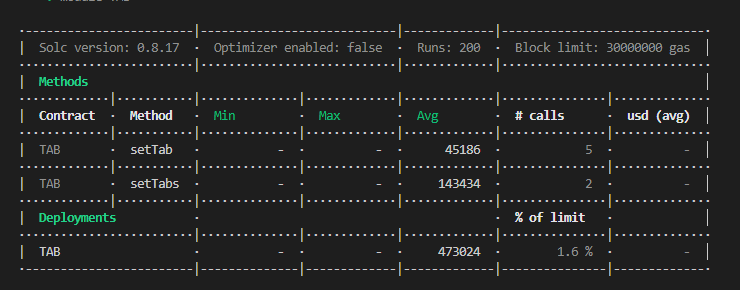
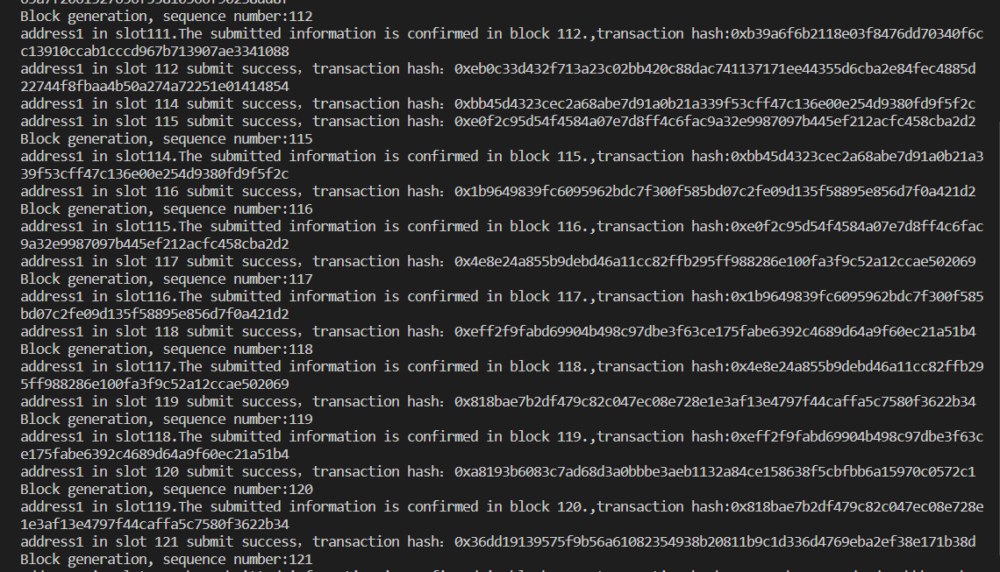
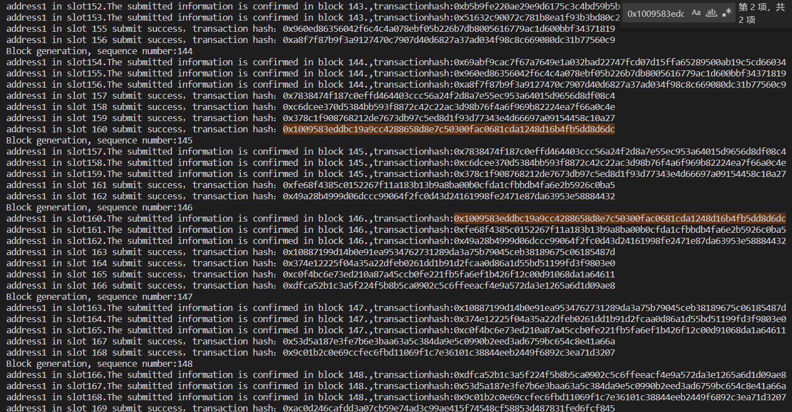
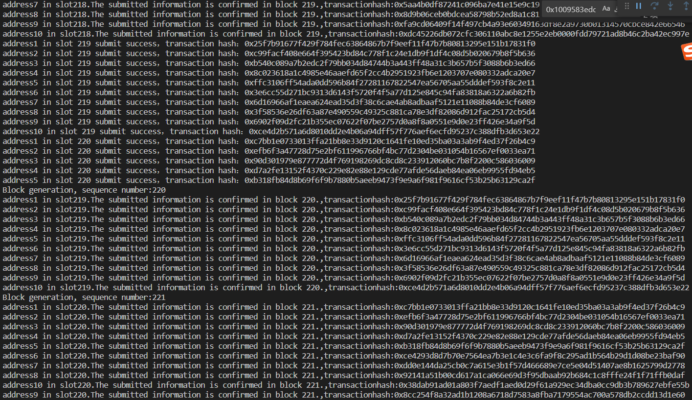
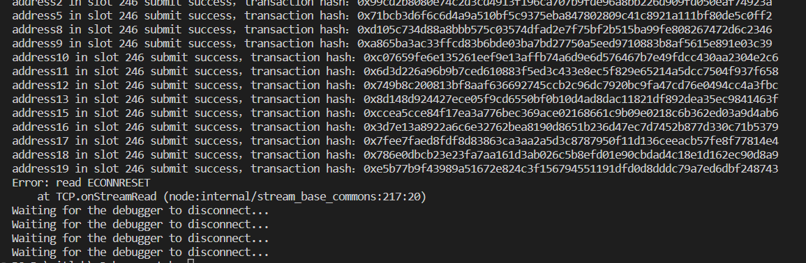

Use Ethereum to create a time-based beacon（TAB）, and each shard chain submits TAB through the Smart Contract.

## 使用

```js
const contract = require("The file path of the compiled contract.");
const CONTRACT_ADDRESS = "The deployment address of the contract, please fill in according to the actual situation. The following address has already been deployed on the test network.";

// goerli:  0x51B2C28f6428a0ab53933E2dc27a2550Ad8108F4
// poloygon_mubai: 0xa712Fa283553DA74A734fa2a8F8CF30Cba969c43
// polygon_mainnet:
// chidao:  0xa712Fa283553DA74A734fa2a8F8CF30Cba969c43
// gnosis:

async function main() {
  const blockHash = "Block hash, please generate according to the actual situation.";
  const tabContract = new ethers.Contract(CONTRACT_ADDRESS, contractABI.abi, wallet); // The wallet should be provided according to the actual situation.

  // Setting the time beacon of a certain shard chain.
  await tabContract.setTab(100, signerOrProvider.address, blockHash);

  // Setting the time beacon of multiple shard chains.
  await tabContract.setTabs(100, [address1, address2], [blockHash1, blockHash2]);

  // Verify whether a certain account has forged a block in a certain time slot.
  const hasBlock = await tabContract.hasBlock(100, address, blockHash);
}

main().catch((error) => {
  console.error(error);
  process.exitCode = 1;
});
```

Pass the contract address and the ethers `signerOrProvider` instance during initialization.

There are three methods.

### setTab(slot,address,hash)

Setting the time beacon of a certain shard chain. This method is used if each shard chain submits information to the time beacon chain separately.

slot：time slot.

address：block producer's account address.

hash：block hash

### setTabs(slot,address[],hash[])

Setting the time beacon of multiple shard chains. This method is used if we have a dedicated chain to handle multiple shard chains, and the information is merged using this method on the dedicated chain.

slot：time slot

address[]：A collection of block producer's account addresses, each representing a block producer on a shard chain.

hash：A collection of block hashes, each representing a block on a shard chain.

### hasBlock(slot,address,hash)

Verify whether a certain account has forged a block in a certain time slot.

slot：time slot

address：A certain account address.

hash：blockhash

## gas

After using hardhat-gas-reporter, the gas consumption is as follows.



## .env

```
PRIVATE_KEY = "xxxxx"
MINING_INTERVAL = 6000
CHIADO_RPC_URL = "https://rpc.chiadochain.net"
GNOSIS_RPC_URL = "https://rpc.gnosischain.com"
POLYGON_ZKEVM_RPC_URL ="https://rpc.public.zkevm-test.net"
GOERLI_CONTRACT_ADDRESS = "0x51B2C28f6428a0ab53933E2dc27a2550Ad8108F4"
POLYGON_MUBAI_CONTRACT_ADDRESS = "0xa712Fa283553DA74A734fa2a8F8CF30Cba969c43"
POLYGON_ZKEVM_CONTRACT_ADDRESS ="0x9785E3A9c5C4544496CD2e72B95bd7de837Bec51"
POLYGON_MAINNET_CONTRACT_ADDRESS = ""
CHIADO_CONTRACT_ADDRESS = "0xa712Fa283553DA74A734fa2a8F8CF30Cba969c43"
GNOSIS_CONTRACT_ADDRESS = ""

```

## benchmark

Use the following code for simulation testing.

```js
// Simulate a test for multiple shard chains with 100k TPS, meaning 100,000 transactions per second. If we have 10 shard chains, then each shard chain should reach 10,000 transactions per second.
const { CONTRACT_ADDRESS, API_KEY, SIGNER_LENGTH = 1, W3_INTERVAL = 6000 } = process.env;
const { ethers } = require("hardhat");
const TAB = require("../index.js");
async function main() {
  const signers = await ethers.getSigners();

  let slot;
  ethers.provider.on("block", async (blockNumber) => {
    console.log("Block generation, sequence number:" + blockNumber);
    if (!slot) {
      console.log("Start simulating submitting information to the beacon chain.", signers.length);
      slot = blockNumber;
      // Assuming our shard chain produces a block every 4 seconds.
      setInterval(() => {
        // In a single slot, we simulate 20 shard chains submitting information to the beacon chain.
        slot++;
        for (let i = 0; i < SIGNER_LENGTH; i++) {
          const blockHash = ethers.utils.randomBytes(32);
          const tabContract = new TAB(CONTRACT_ADDRESS, signers[i % 20]);
          let currentSlot = slot;
          tabContract.setTab(currentSlot, signers[i % 20].address, blockHash).then((tx) => {
            console.log(`address ${i + 1} in slot ${currentSlot} submit succes，transaction hash：${tx.hash}`);
            ethers.provider.waitForTransaction(tx.hash).then((receipt) => {
              console.log(`address ${i + 1}:in slot${currentSlot} .The submitted information is confirmed in block ${receipt.blockNumber},Confirmed transaction hash.:${tx.hash}`);
            });
          });
        }
      }, W3_INTERVAL);
    }
  });
}

// We recommend this pattern to be able to use async/await everywhere
// and properly handle errors.
main()
  .then(() => {
    // process.exit(1);
  })
  .catch((error) => {
    console.error(error);
    process.exit(1);
  });
```

Assuming the Ethereum block time is 6 seconds, and our shard chain block time (slot) is `W3_INTERVAL`, with `SIGNER_LENGTH` shard chains in each slot.

We use hardhat to start an Ethereum node and then run the benchmark script. When a block is produced, we record the current block height to initialize our slot number and start a timer to execute all shard chains' tab submission to the smart contract every `W3_INTERVAL`.

We first set `W3_INTERVAL` to 6000 to keep it consistent with the block production time of the Hardhat node, and set `SIGNER_LENGTH` to 1, which means that there is only 1 shard. It can be seen that following this rhythm, transactions on the contract will be successfully packed in the next block.



We set the slot to 2000 with only one shard chain. As a result, we found that some transactions were not confirmed until two blocks later, as highlighted in red in the following image.



We adjusted the slot to 6000 and used ten shards, and found that the simulation was relatively stable, and transactions on the contract were successfully packaged in the next block.



We increased the number of shard chains to 64 and found that some transactions were not packaged until the next block after the next block.

We adjusted the slot to 1000, but used 20 shard chains. After running for about 12 seconds, we encountered the following error, I'm not sure if it's because the local hardhat network can't handle it.


